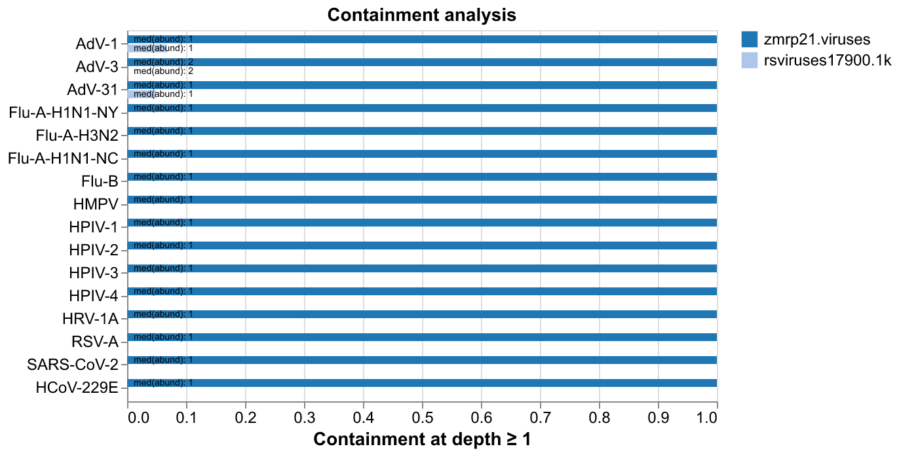

# Grate

Like [knownknowns](https://github.com/bede/knownknowns), but faster. A fork of [Deacon](https://github.com/bede/deacon).

## Install & update

```bash
RUSTFLAGS="-C target-cpu=native" cargo install --git https://github.com/bede/grate
```

## Usage

```bash
# Calculate containment of target sequences in reads
grate con refs.fa reads.fastq.gz

# Calculate target containment in multiple samples
grate con refs.fa reads1.fastq.gz reads2/ reads3.fa.zst…

# Plot containment bar and scatter
grate con -f csv refs.fa s1.fq.gz s2.fq.gz > results.csv
uv run plot/con.py --mode bar results.csv
uv run plot/con.py --mode scatter results.csv

# Plot sequence length histograms
grate len refs.fa s1.fq.gz s2.fq.gz > len.csv
uv run plot/lenhist.py len.csv -f -b 500

# Plot syncmer abundance histogram
grate con -f json refs.fa s1.fq.gz s2.fq.gz > results.json
uv run plot/minhist.py results.json

# Stdin
zstdcat reads3.fq.zst | grate con refs.fa

# View plotting options
uv run plot/con.py -h
uv run plot/minhist.py -h
```

Run the plotting scripts with [uv](https://docs.astral.sh/uv/) to automatically handle dependencies.

**Plotting scripts:**
- `plot/con.py` - Containment bar chart from CSV output
- `plot/minhist.py` - Abundance distribution histograms from JSON output (one row per target, one line per sample)



### CLI Reference

```bash
$ grate con -h
Calculate sequence containment & abundance in fastx files or directories thereof

Usage: grate con [OPTIONS] <TARGETS> <SAMPLES>...

Arguments:
  <TARGETS>     Path to fasta file containing target sequence record(s)
  <SAMPLES>...  Path(s) to fastx files/dirs (- for stdin). Each file/dir is treated as a separate sample

Options:
  -k, --kmer-length <KMER_LENGTH>
          k-mer length (1-61) [default: 31]
  -s, --smer-size <smer_length>
          S-mer size for open syncmer selection (s < k, s must be odd) [default: 15]
  -a, --abundance-thresholds <ABUNDANCE_THRESHOLDS>
          Comma-separated abundance thresholds for containment calculation [default: 10]
  -d, --discriminatory
          Consider only syncmers unique to each target
  -t, --threads <THREADS>
          Number of execution threads (0 = auto) [default: 8]
  -l, --limit <LIMIT>
          Terminate read processing after approximately this many bases (e.g. 50M, 10G)
  -o, --output <OUTPUT>
          Path to output file (- for stdout) [default: -]
  -f, --format <FORMAT>
          Output format [default: table] [possible values: table, csv, json]
  -n, --names <SAMPLE_NAMES>
          Comma-separated sample names (default is file/dir name without extension)
  -S, --sort <SORT>
          Sort displayed results: o=original, t=target, s=sample, c=containment (descending) [default: o] [possible values: o, t, s, c]
  -q, --quiet
          Suppress progress reporting
  -h, --help
          Print help
```

