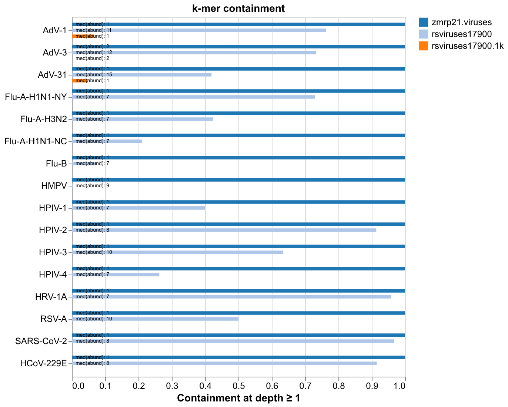

[](https://crates.io/crates/skope)

# Skope

Accelerated syncmer containment and abundance estimation.

## Install & update

```bash
# Latest stable
RUSTFLAGS="-C target-cpu=native" cargo install skope

# Latest from git
RUSTFLAGS="-C target-cpu=native" cargo install --git https://github.com/bede/skope
```

## Usage

```bash
# Calculate containment of target sequences in reads
skope query refs.fa reads.fastq.gz

# Treat each record in a multi-record fastx as a separate target
skope query -i viruses.fa reads.fastq.gz

# Calculate target containment in multiple samples
skope query refs.fa reads1.fastq.gz reads2/ reads3.fa.zst…

# Calculate containment at depth>=100 using only discriminatory syncmers
skope query -a 100 --discriminatory refs.fa reads1.fastq.gz reads2/ reads3.fa.zst…

# Plot query results (containment bar chart or scatter)
skope query refs.fa s1.fq.gz s2.fq.gz > query.tsv
uv run plot/query.py query.tsv --mode bar -o query_bar.png
uv run plot/query.py query.tsv --mode scatter -o query_scatter.png

# Plot per-group sequence length histograms (e.g. host vs viral)
skope lenhist groups.skcl s1.fq.gz s2.fq.gz > len.tsv
uv run plot/lenhist.py len.tsv

# Or without group filtering — all reads go to a single "all" bucket
skope lenhist - s1.fq.gz s2.fq.gz > len.tsv

# Stdin
zstdcat reads3.fq.zst | skope query refs.fa -

# Build a classification index (.skcl) and classify reads against it
skope index build groups/ -o groups.skcl
skope classify groups.skcl reads.fq.gz

# View help for any command
skope query -h
skope lenhist -h
skope index build -h
```

Run the plotting scripts with [uv](https://docs.astral.sh/uv/) to automatically handle dependencies.

**Plotting scripts:**
- `plot/query.py` - Containment bar charts and scatter plots from `query` TSV output
- `plot/lenhist.py` - Length distribution histograms from `lenhist` TSV output



### CLI Reference

**Main commands**
```
  query     Estimate syncmer containment & abundance in fastx file(s) or directories thereof
  classify  Classify sequences into groups based on syncmer membership
  lenhist   Generate per-group length histograms based on syncmer classification
  index     Build and manage classification indexes
```

**Query containment**

```bash
$ skope query -h
Estimate syncmer containment & abundance in fastx file(s) or directories thereof

Usage: skope query [OPTIONS] <TARGETS> <SAMPLES>...

Arguments:
  <TARGETS>     Path to fastx file (treated as single target unless -i set) or directory of fastx files/subdirs (one target per child file/subdir)
  <SAMPLES>...  Path(s) to fastx files/dirs (- for stdin). Each file/dir is treated as a separate sample

Options:
  -k, --kmer-length <KMER_LENGTH>
          K-mer length (1-61) [default: 31]
  -s, --smer-length <SMER_LENGTH>
          S-mer length used for open syncmer selection (s < k, s must be odd) [default: 9]
  -a, --abundance-thresholds <ABUNDANCE_THRESHOLDS>
          Comma-separated additional abundance thresholds for containment estimation [default: 10]
  -d, --discriminatory
          Consider only syncmers unique to each target
      --disjoint
          Use only non-overlapping (disjoint) syncmers
  -i, --individual
          Treat each fastx record as separate target (default: merge records into one target named after file)
  -t, --threads <THREADS>
          Number of execution threads (0 = auto) [default: 8]
  -l, --limit <LIMIT>
          Terminate processing after approximately this many bases (e.g. 50M, 10G)
  -o, --output <OUTPUT>
          Path to output file (- for stdout) [default: -]
  -f, --format <FORMAT>
          Output format [default: tsv] [possible values: tsv, table]
  -n, --names <SAMPLE_NAMES>
          Comma-separated sample names (default is file/dir name without extension)
  -S, --sort <SORT>
          Sort displayed results: c=containment (descending), t=target, s=sample, o=original [default: c] [possible values: c, t, o, s]
  -q, --quiet
          Suppress progress reporting
      --no-total
          Suppress TOTAL summary rows in output
      --dump-positions <DUMP_POSITIONS>
          Dump open syncmer positions to TSV file (target\tposition)
  -h, --help
          Print help
```

**Length histogram**

`lenhist` shares its group-input model with `classify`: pass a `.skcl` index (or a
directory of fastx files/subdirectories, one group per top-level entry) and each
read is binned into exactly one bucket — its single matching group, `ambiguous`
(multiple groups), or `unclassified` (no group). Pass `-` instead of an index to
disable filtering; all reads then go to a single `all` bucket. Output is a TSV
with one row per `(sample, group, length)` triple.

```bash
$ skope lenhist -h
Generate per-group length histograms based on syncmer classification

Usage: skope lenhist [OPTIONS] <INDEX> <SAMPLES>...

Arguments:
  <INDEX>       Path to .skcl classification index file, directory of fastx files/subdirectories (one group per top-level entry), or - to disable group filtering (single "all" bucket)
  <SAMPLES>...  Path(s) to fastx files/dirs (- for stdin). Each file/dir is treated as a separate sample

Options:
  -k, --kmer-length <KMER_LENGTH>    K-mer length (only used when index is a directory or -) (1-61, must be odd) [default: 31]
  -s, --smer-length <SMER_LENGTH>    S-mer length used for open syncmer selection (only used when index is a directory or -) [default: 9]
  -m, --min-hits <MIN_HITS>          Minimum syncmer hits to classify a sequence to a group [default: 1]
  -r, --min-fraction <MIN_FRACTION>  Minimum fraction of sequence syncmers hitting a group [default: 0]
  -d, --discriminatory               Consider only syncmers unique to each group
  -t, --threads <THREADS>            Number of execution threads (0 = auto) [default: 8]
  -l, --limit <LIMIT>                Terminate processing after approximately this many bases (e.g. 50M, 10G)
  -o, --output <OUTPUT>              Path to output file (- for stdout) [default: -]
  -n, --names <SAMPLE_NAMES>         Comma-separated sample names (default is file/dir name without extension)
  -q, --quiet                        Suppress progress reporting
  -h, --help                         Print help
```

