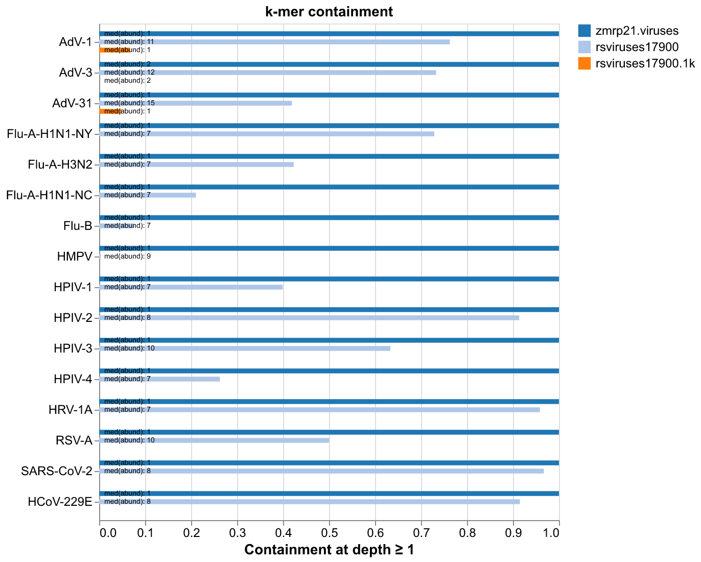

[](https://crates.io/crates/skope)
[](https://anaconda.org/bioconda/skope)

# Skope

Accelerated streaming containment and abundance estimation using syncmers. Like Mash Screen or Sylph, only much faster for small queries (up to 10 gigabases/second), despite more dense and even *k*-mer sampling. Rapidly estimates coverage at chosen depth thresholds, providing a viable alternative to mapping-based coverage estimation in many contexts. Optimised for screening large datasets for small query sequences (<1 gigabase) such as genes and genomes of viruses and bacteria, scaling to larger query genomes given sufficient memory. No prior sketching is required, and memory use is bounded by the size of query (needle) sequences rather than by the size of subject (haystack) sequences.

## Install & update

```bash
# Bioconda
conda install -c bioconda deacon

# Latest stable
RUSTFLAGS="-C target-cpu=native" cargo install skope

# Latest from git
RUSTFLAGS="-C target-cpu=native" cargo install --git https://github.com/bede/skope
```

## Usage

```bash
# Calculate containment of target sequences in reads
skope query refs.fa reads.fastq.gz

# Treat each record in a multi-record fastx as a separate target
skope query -i refs.fa reads.fastq.gz

# Calculate target containment in multiple samples
skope query refs.fa reads1.fastq.gz reads2/ reads3.fa.zst…

# Calculate containment at depth>=100 using only discriminatory syncmers
skope query -i -a 100 --discriminatory refs.fa reads1.fastq.gz reads2/ reads3.fa.zst…

# Plot query results (containment bar chart or scatter)
skope query -i refs.fa s1.fq.gz s2.fq.gz > query.tsv
uv run plot/query.py query.tsv --mode bar -o query-bar.png
uv run plot/query.py query.tsv --mode decay -o query-decay.png
uv run plot/query.py query.tsv --mode scatter -o query-scatter.png
uv run plot/query.py query.tsv --mode scatter -o query-scatter.html  # Interactive

# Plot per-group sequence length histograms (e.g. host vs viral)
skope lenhist groups.sk s1.fq.gz s2.fq.gz > len.tsv
uv run plot/lenhist.py len.tsv

# Targets can equally be a fastx file (one group), a directory (one group per child),
# or -i to make each fastx record its own group
skope lenhist refs.fa s1.fq.gz > len.tsv
skope lenhist -i refs.fa s1.fq.gz > len.tsv

# Or without group filtering — all reads go to a single "all" bucket
skope lenhist - s1.fq.gz s2.fq.gz > len.tsv

# Stdin
zstdcat reads3.fq.zst | skope query refs.fa -

# Mask off-target background syncmers to cut false positives, at runtime…
skope query refs.fa -b background.fa reads.fq.gz
# …or baked once into a reusable query index (.sk)
skope index build-query refs.fa -b background.fa -o refs.sk
skope query refs.sk reads.fq.gz

# The build commands take targets on stdin too (they have no samples competing for it)
zstdcat refs.fa.zst | skope index build-query - -o refs.sk

# Build a classification index (.sk) and classify reads against it
skope index build-classify groups/ -o groups.sk
skope classify groups.sk reads.fq.gz
# …or classify straight from fastx, skipping the index
skope classify groups/ reads.fq.gz
skope classify refs.fa reads.fq.gz

# View help for any command
skope query -h
skope lenhist -h
skope index build-query -h
```

Run the plotting scripts with [uv](https://docs.astral.sh/uv/) to automatically handle dependencies.

**Plotting scripts:**
- `plot/query.py` - Containment bar charts and scatter plots from `query` TSV output
- `plot/lenhist.py` - Length distribution histograms from `lenhist` TSV output



### CLI Reference

**Main commands**
```
  query     Estimate syncmer containment & abundance in fastx file(s) or directories thereof
  classify  Classify sequences into groups by their syncmer content (alpha)
  lenhist   Generate per-group length histograms based on syncmer classification (alpha)
  index     Build and manage query and classification indexes (alpha)
```

**Query**

```bash
$ skope query -h
Estimate target containment & abundance in fastx file(s) or directories thereof using open syncmers

Usage: skope query [OPTIONS] <TARGETS> <SAMPLES>...

Arguments:
  <TARGETS>     Path to fastx file (single target unless -i), directory of fastx files/subdirs (one target per child file/subdir) or query index (.sk)
  <SAMPLES>...  Path(s) to fastx files/dirs (- for stdin). Each file/dir is treated as a separate sample

Options:
  -k, --kmer <K>                        K-mer length (1-61, default 31), read from a prebuilt index
  -s, --smer <S>                        S-mer length (odd, s < k, default 9), read from a prebuilt index
  -i, --individual                      Treat each fastx record as separate target (default: merge records into one target)
  -c, --confidence                      Report confidence intervals, ANI estimates, and patchiness columns
  -d, --discriminatory                  Consider only syncmers unique to each target
  -f, --fraction <FLOAT>                Fraction of target syncmers to keep [0, 1] [default: 1]
  -a, --abundance-thresholds <INT,...>  Comma-separated additional abundance thresholds for containment estimation [default: 10]
  -b, --background <BACKGROUND>         Path to fastx file(s) whose syncmers we wish to drop from our targets
  -l, --limit <BASES>                   Terminate processing after approximately this many bases (e.g. 50M, 10G)
  -t, --threads <THREADS>               Number of execution threads (0 = auto) [default: 8]
  -o, --output <OUTPUT>                 Path to output file (- for stdout) [default: -]
  -n, --names <NAME,...>                Comma-separated sample names (default is file/dir name without extension)
      --sort <SORT>                     Sort results [default: containment] [possible values: containment, target, input]
      --dump-syncmers <FILE>            Dump selected target syncmers to TSV file (target, position, kmer)
      --no-total                        Suppress TOTAL summary rows in output
  -q, --quiet                           Suppress progress reporting
  -h, --help                            Print help
```

**Classify** <sup>alpha</sup>

```bash
$ skope classify -h
Classify sequences into groups by syncmer content (alpha)

Usage: skope classify [OPTIONS] <TARGETS> <SAMPLES>...

Arguments:
  <TARGETS>     Path to fastx file (single group unless -i), directory of fastx files/subdirs (one group per child file/subdir) or classification index (.sk)
  <SAMPLES>...  Path(s) to fastx files/dirs (- for stdin)

Options:
  -i, --individual                     Treat each fastx record as a separate group (single fastx file only)
  -k, --kmer <K>                       K-mer length (1-61, default 31), read from a prebuilt index
  -s, --smer <S>                       S-mer length (odd, s < k, default 9), read from a prebuilt index
  -d, --discriminatory                 Consider only syncmers unique to each group
  -a, --abs-threshold <ABS_THRESHOLD>  Minimum absolute number of syncmer hits for a match [default: 1]
  -r, --rel-threshold <REL_THRESHOLD>  Minimum relative proportion (0.0-1.0) of syncmer hits for a match [default: 0]
  -l, --limit <BASES>                  Terminate processing after approximately this many bases (e.g. 50M, 10G)
  -t, --threads <THREADS>              Number of execution threads (0 = auto) [default: 8]
  -o, --output <OUTPUT>                Path to output file (- for stdout) [default: -]
  -n, --names <NAME,...>               Comma-separated sample names (default is file/dir name without extension)
      --per-seq                        Output per-sequence classifications instead of summary
  -q, --quiet                          Suppress progress reporting
  -h, --help                           Print help
```

**Lenhist** <sup>alpha</sup>

```bash
$ skope lenhist -h
Generate per-group length histograms based on syncmer classification (alpha)

Usage: skope lenhist [OPTIONS] <TARGETS> <SAMPLES>...

Arguments:
  <TARGETS>     Path to fastx file (single group unless -i), directory of fastx files/subdirs (one group per child file/subdir), classification index (.sk), or - to disable group filtering (single "all" bucket)
  <SAMPLES>...  Path(s) to fastx files/dirs (- for stdin). Each file/dir is treated as a separate sample

Options:
  -i, --individual                     Treat each fastx record as a separate group (single fastx file only)
  -k, --kmer <K>                       K-mer length (1-61, default 31), read from a prebuilt index
  -s, --smer <S>                       S-mer length (odd, s < k, default 9), read from a prebuilt index
  -d, --discriminatory                 Consider only syncmers unique to each group
  -a, --abs-threshold <ABS_THRESHOLD>  Minimum absolute number of syncmer hits for a match [default: 1]
  -r, --rel-threshold <REL_THRESHOLD>  Minimum relative proportion (0.0-1.0) of syncmer hits for a match [default: 0]
  -l, --limit <BASES>                  Terminate processing after approximately this many bases (e.g. 50M, 10G)
  -t, --threads <THREADS>              Number of execution threads (0 = auto) [default: 8]
  -o, --output <OUTPUT>                Path to output file (- for stdout) [default: -]
  -n, --names <NAME,...>               Comma-separated sample names (default is file/dir name without extension)
  -q, --quiet                          Suppress progress reporting
  -h, --help                           Print help
```

## Confidence and diagnostics

Passing `--confidence` (`-c`) to `skope query` adds output columns for confidence, ANI, and coverage 'patchiness'.

```bash
skope query --confidence refs.fa reads.fq
```

- `containmentX_ci`: a 95% Wilson score confidence interval for each containment estimate reflecting uncertainty in the proportion `hits/target_kmers` at each abundance threshold. This is written as `{lower}-{upper}`. Intervals are narrower for long target sequences and wider for short targets and/or low containment.

- `patchiness`: a Wald–Wolfowitz runs test for clustering of `containment1` hits along the target sequence. Written as `{z}|{p}`, positive `z` means that selected *k*-mer distribution is more more patchy than expected for the same hit count, and `p` is the one-sided normal-approximation p-value. Displayed only for `z > 0` and `p <= 0.05` (otherwise `-`), which can also mean the test was skipped for too few eligible syncmers, hits, or misses.

- `ani_est`: a containment ANI estimate based on `containment1`. Skope transforms containment with `containment^(1/k)`, and when the low-coverage depth histogram is sufficient it first applies the Sylph-like Poisson sampling adjustment `containment1 / Pr(Pois(λ) >= 1)`. If the adjustment cannot be estimated, the unadjusted containment ANI is reported instead.

  `ani_est` is shown as `-` (suppressed) for any target with fewer than 50 syncmers, with no contained syncmers, or whose estimate falls below 0.90, since these yield too little signal for a meaningful estimate.

  The Poisson adjustment is skipped under the following conditions:

  - _Median nonzero depth > 2_: the adjustment is designed for *low-coverage* targets

  - _Fewer than 50 target syncmers_: too small a target to estimate `λ` reliably.

  - _Fewer than 25 hitting syncmers_: too little signal.

  - _A too-sparse abundance histogram_: `λ` is recovered from the Poisson relation `λ = (m+1)·count(m+1)/count(m)`, where `m` is the modal nonzero depth. This ratio is stable only when both bins are populated, so if the mode or adjacent bin has fewer than 3 syncmers, we reject the estimate.

## Dumping syncmers

Passing `--dump-syncmers <path>` to `skope query` writes the selected target syncmers to a TSV file with columns `target`, `position`, and `kmer`. The dump reflects whatever selection is in effect, so `--discriminatory` is respected.

One row is emitted per syncmer occurrence, so the row count can exceed `target_kmers` (which counts distinct syncmers) when a k-mer recurs within a target. The `kmer` column is the canonical *k*-mer, not necessarily the forward-strand sequence at that position.
