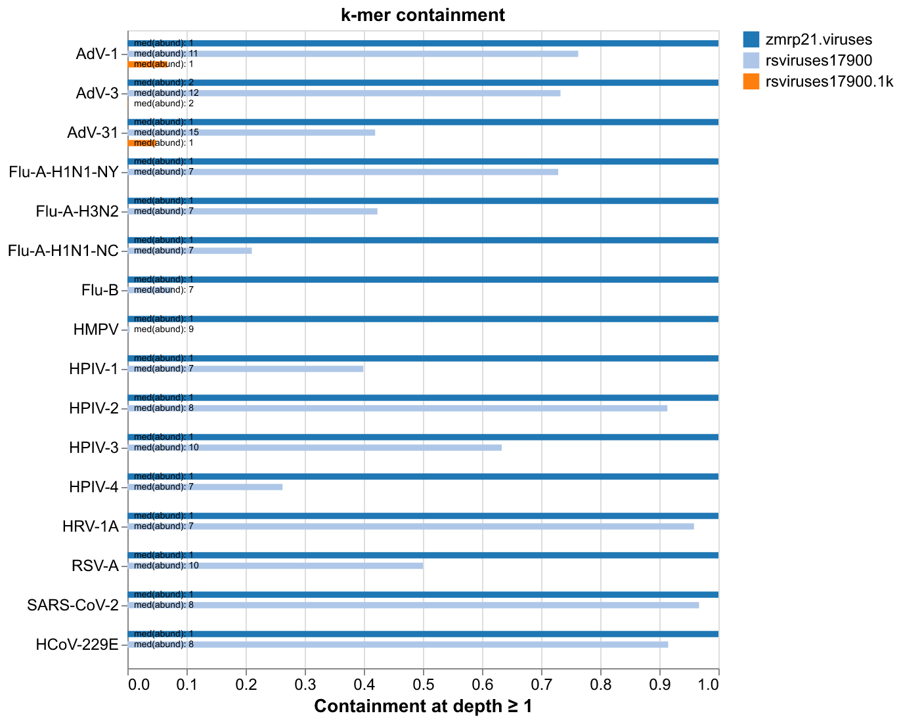

[](https://crates.io/crates/skope) [](https://anaconda.org/bioconda/skope)

# Skope

Accelerated abundance-aware containment estimation. Uses syncmers by default for dense and even target *k*-mer sampling, with sparser sampling possible using optional FracMinHash (`--fraction`). Unlike existing tools Sylph, Sourmash and Mash Screen, Skope meaningfully parallelises individual FASTA/Q and BINSEQ CBQ file processing, sustaining up to 10 Gbp/s single file throughput. Skope is optimised for screening large sequence collections for smaller target sequences such as genes or microbial genomes, storing only target *k*-mers in memory. Skope supports specifying arbitrary abundance thresholds at which to calculate containment, providing a fast alternative to mapping-based coverage-at-depth calculation. Skope's `--discriminatory` mode enables containment calculation using only *k*-mers exclusive to each target, facilitating e.g. strain identification. The `--background` argument similarly removes from consideration any *k*-mers shared between targets and specified background sequences, making it possible to precompute a target *k*-mer index excluding nonspecific background *k*-mers. Skope's set data structure is collision-free by design, and syncmer selection may be bypassed entirely using `--all-kmers` in order to e.g. hunt for specific *k*-mers of interest in large sequence collections .

Skope is being used in applications such as [metagenomic control validation](https://www.medrxiv.org/content/10.64898/2026.05.18.26353500v1), [wastewater surveillance](https://github.com/nrminor/silly-fast-bfx), and bacterial strain identification. For the time being, please use the following citation for Skope:

>  Stepniak et al. (2026). Library preparation strategy critically impacts RNA virus sensitivity in clinical metagenomics. *medRxiv*. https://doi.org/10.64898/2026.05.18.26353500

## Install

```bash
# Bioconda
conda install -c bioconda deacon

# Latest stable
RUSTFLAGS="-C target-cpu=native" cargo install skope

# Latest from git
RUSTFLAGS="-C target-cpu=native" cargo install --git https://github.com/bede/skope
```

## Usage

```bash
# Calculate containment of target sequences in a sequence collection
skope query refs.fa sample.fastq.gz

# Treat each record in a multi-record fastx as a separate target
skope query -i refs.fa sample.fastq.gz

# Calculate target containment in multiple samples
skope query refs.fa sample1.fastq.gz sample2/ sample3.fa.zst…

# Calculate containment at depth>=100 using only discriminatory k-mers
skope query -i -a 100 --discriminatory refs.fa sample1.fastq.gz sample2/ sample3.fa.zst…

# Plot query results (containment bar chart or scatter)
skope query -i refs.fa s1.fq.gz s2.fq.gz > query.tsv
uv run plot/query.py query.tsv --mode bar -o query-bar.png
uv run plot/query.py query.tsv --mode decay -o query-decay.png
uv run plot/query.py query.tsv --mode scatter -o query-scatter.png
uv run plot/query.py query.tsv --mode scatter -o query-scatter.html  # Interactive

# Stdin
zstdcat sample.fq.zst | skope query refs.fa -

# BINSEQ CBQ input (.cbq, or .cba without quality scores), single or paired
skope query refs.fa sample.cbq paired.cba

# Mask off-target background k-mers in background.fa
skope query refs.fa -b background.fa sample.fq.gz
# …or baked once into a reusable query index (.sk)
skope index build-query refs.fa -b background.fa -o refs.sk
skope query refs.sk sample.fq.gz

# Bypass syncmer selection and consider every (canonical) k-mer
skope query --all-kmers -i kmers31.fa sample.fastq.gz

# The build commands take targets on stdin too (they have no samples competing for it)
zstdcat refs.fa.zst | skope index build-query - -o refs.sk
```

Run the plotting scripts with [uv](https://docs.astral.sh/uv/) to automatically handle dependencies.

**Plotting scripts:**
- `plot/query.py` - Containment bar charts and scatter plots from `query` TSV output



### CLI Reference

**Main commands**
```
query     Estimate k-mer containment & abundance in sequence collections
index     Build and manage query indexes (alpha)
```

**Query**

```bash
$ skope query -h
Estimate target containment & abundance in sequence collections using open syncmers or all k-mers

Usage: skope query [OPTIONS] <TARGETS> <SAMPLES>...

Arguments:
  <TARGETS>     Path to fastx/CBQ file (single target unless -i), directory of such files/subdirs (one target per child file/subdir) or query index (.sk)
  <SAMPLES>...  Samples as fastx/CBQ files/dirs (- for stdin), or comma-separated mate files (R1,R2)

Options:
  -k, --kmer <K>                        K-mer length (1-61, default 31), read from a prebuilt index
  -s, --smer <S>                        S-mer length (odd, s < k, default 9), read from a prebuilt index
  -i, --individual                      Treat each record as a separate target (default: merge records into one target)
  -c, --confidence                      Report confidence intervals, ANI estimates, and patchiness columns
  -d, --discriminatory                  Consider only k-mers unique to each target
      --all-kmers                       Evaluate all k-mers, bypassing syncmer selection (alias for s=0)
      --complexity <FLOAT>              Discard target k-mers below this kdust complexity [0, 1] (0 = retain all) [default: 0]
  -f, --fraction <FLOAT>                FracMinHash fraction of target k-mers to keep [0, 1] [default: 1]
  -a, --abundance-thresholds <INT,...>  Comma-separated additional abundance thresholds for containment estimation [default: 10]
  -b, --background <BACKGROUND>         Path to fastx/CBQ file(s) whose k-mers we wish to drop from our targets
  -n, --names <NAME,...>                Comma-separated sample names (default is file/dir name without extension)
      --interleaved                     Sample files outside R1,R2 pairs are interleaved pairs
  -l, --limit <BASES>                   Terminate processing after approximately this many bases (e.g. 50M, 10G)
  -t, --threads <THREADS>               Number of execution threads (0 = auto) [default: 8]
  -o, --output <OUTPUT>                 Path to output file (- for stdout) [default: -]
      --sort <SORT>                     Sort results [default: containment] [possible values: containment, target, input]
      --dump-kmers <FILE>               Dump selected target k-mers to TSV file (target, position, kmer)
      --no-total                        Suppress TOTAL summary rows in output
  -q, --quiet                           Suppress progress reporting
  -h, --help                            Print help
```

## Confidence

Passing `--confidence` (`-c`) to `skope query` adds output columns for confidence, estimated ANI, and coverage 'patchiness'.

```bash
skope query --confidence refs.fa sample.fq
```

- `containmentX_ci`: a 95% Wilson score confidence interval for each containment estimate reflecting uncertainty in the proportion `hits/target_kmers` at each abundance threshold. This is written as `{lower}-{upper}`. Intervals are narrower for long target sequences and wider for short targets and/or low containment.

- `patchiness`: a Wald–Wolfowitz runs test for clustering of `containment1` hits along the target sequence. Written as `{z}|{p}`, positive `z` means that selected *k*-mer distribution is more more patchy than expected for the same hit count, and `p` is the one-sided normal-approximation p-value. Displayed only for `z > 0` and `p <= 0.05` (otherwise `-`), which can also mean the test was skipped for too few eligible k-mers, hits, or misses.

- `ani_est`: a containment ANI estimate based on `containment1`. Skope transforms containment with `containment^(1/k)`, and when the low-coverage depth histogram is sufficient it first applies the Sylph-like Poisson sampling adjustment `containment1 / Pr(Pois(λ) >= 1)`. If the adjustment cannot be estimated, the unadjusted containment ANI is reported instead.

  `ani_est` is shown as `-` (suppressed) for any target with fewer than 50 k-mers, with no contained k-mers, or whose estimate falls below 0.90, since these yield too little signal for a meaningful estimate.

  Calculating `ani_est` is skipped under the following conditions:

  - Median nonzero depth > 2

  - Fewer than 50 target k-mers

  - Fewer than 25 hitting k-mers

  - Fewer than 3 k-mers at either the modal nonzero depth or the depth above it

## Paired samples

Give a paired sample as two comma-separated files (R1,R2), or use `--interleaved` for interleaved files. Paired and single samples can share a run. Mates pool their *k*-mers: `query` counts each target *k*-mer at most once per pair, while `classify` and `lenhist` give both mates the same classification. `classify --per-seq` writes one row per pair. A paired sample is named after its R1 file, minus a mate tag such as `_R1`.

Summaries count both mates, and `lenhist` bins their lengths separately under the pair's classification. `--limit` is approximate and checked per batch, so in-flight batches can finish beyond the limit.

```bash
skope query refs.fa a_R1.fq.gz,a_R2.fq.gz b_R1.fq.gz,b_R2.fq.gz c.fq.gz
skope query --interleaved refs.fa a.interleaved.fq.gz
```

## CBQ input

Skope reads [BINSEQ](https://www.biorxiv.org/content/10.1101/2025.04.08.647863v2) CBQ files (.cbq, or .cba without quality scores) wherever it reads fastx files: as targets, backgrounds and samples. Paired CBQ files keep their pairing, so need no extra arguments.

Memory use grows with thread count and CBQ block size, and blocks of 1 MiB or less work best. Quality scores are decompressed but never used, so quality-free .cba files are faster to read.

## Dumping target k-mers

Passing `--dump-kmers <path>` to `skope query` writes the selected _canonical_ target k-mers to a TSV file with columns `target`, `position`, and `kmer`. The dump reflects whatever selection is in effect, so `--discriminatory` is respected. N.B. One row is emitted per k-mer occurrence, so the row count can exceed `target_kmers` (which counts distinct k-mers) when a *k*-mer recurs within a target.
